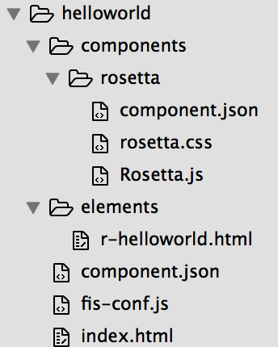

## 手把手教你写一个```helloworld```项目

### 创建helloworld项目
```js
mkdir helloworld
cd helloworld
```

### 新建静态资源依赖的component.json，内容如下
```js

{
    "protocol": "github",
    "github": {
        "author": "fis-components"
    },
    "dependencies": [
        "github:fis-components/rosetta@^1.0.2"
    ]
}

```

安装依赖
``` js
fis3 install --root .
```
命令执行后会生成'components'目录


### 新建```js r-helloworld```组件
```js
mkdir elements
cd elements
touch r-helloworld.html
```


r-helloworld.html内容如下
```html
<element name="r-helloworld">
    <style>

    </style>
    <template>
        {hellotext}
    </template>
    <script type="text/javascript">
        Rosetta({
            is: 'r-helloworld',
            properties: {
                hellotext: String
            }
        });
    </script>
</element>
```


### 根目录下新建index.html，并配置静态资源引用
```html
<!DOCTYPE html>
<html>
<head>
    <title>Rosetta的helloworld</title>
</head>
<body>
    <link rel="import" href="/elements/r-helloworld.html" />
    <r-helloworld hellotext="你好我是helloworld" ref="helloworld1">
    </r-helloworld>

    <script type="text/javascript" data-framework=true src="/components/rosetta/Rosetta.js"></script>

    <script type="text/javascript">
        Rosetta.ready(function() {
            var helloworld1 = Rosetta.ref('helloworld1');

            document.addEventListener('click', function() {
                helloworld1.update({
                    hellotext: helloworld1.hellotext + ' clicked'
                });
            }, false);
        });
    </script>
</body>
</html>

```


### 根目录下新建FIS3的配置文件，```js fis-conf.js```，内容示例如下
```js

fis
    // 用rosetta的parser插件进行element定义文件解析、使用处的import语法解析
    .match('*.{html,tpl}', {
        parser: fis.plugin('rosetta', {
            compileUsage: false
        })
    })

    .match('*.tpl', {
        release: '/template/$0'
    })

    .match('/elements/r-*.html', {
        rExt: '.js'
    })
    .match('/elements/*.*', {
        release: '/static/$0'
    })

    .match('/components/**/r-*.html', {
        rExt: '.js'
    })

    .match('/components/(**/*.*)', {
        useMap: true,
        release: '/static/$1'
    })

    .match('::packager', {
        postpackager: fis.plugin('rosetta', {

        })
    });

// 在 dev 环境下关闭文件 md5 hash
fis
    .media('dev')
    .match('*.{css,js,html}', {
        useHash: false
    })
    // .set('deploy', {
    //   receiver: 'http://dbl-dev-rd22.vm.baidu.com:8343/receiver',
    //   from: '/',
    //   subOnly: true,
    //   to: '/home/work/webroot/templates/templates/eva_zhidaorder_gao'
    // })


// fis3 release production
fis
    .media('production')
    // 压缩 js 通过 uglify
    .match('*.js', {
        optimizer: fis.plugin('uglify-js')
    })

    // 这里面也是 js
    .match('/elements/*.html', {
        optimizer: fis.plugin('uglify-js')
    })

    // 压缩 css
    .match('*.css', {
        optimizer: fis.plugin('clean-css')
    })

    // 压缩 png
    .match('*.png', {
        optimizer: fis.plugin('png-compressor')
    })

    .match('::packager', {
        postpackager: fis.plugin('rosetta', {
            allInOne: true
        })
    });

```

### 到现在目录结构应该是这样的



### 运行和预览
```js
    fis3 server start --type node
    fis3 release -w --root .
```